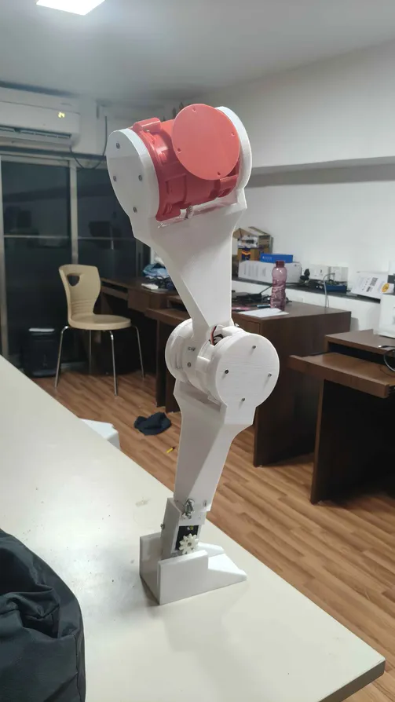

# Flexwalk

This project focuses on designing and fabricating a humanoid bipedal lower body (40-50 cm height) inspired by open-source humanoid platforms such as Asimov.  
We will develop a mechanically feasible lower-body humanoid structure capable of replicating human leg kinematics using Hip (Roll + Pitch), Knee (Pitch), and Ankle (Pitch) joints.

---

## Dependencies

- Mechanical Design
- 3D Printing
- Kinematics

---

## Visuals

---

## Project Status

We are done with 1st iteration of 3D printing Flexwalk and now working on version 2 of Flexwalk.  
We have started simulation on MuJoCo and applying inverse kinematics on the Bipedal.

---

## Commit Messages

- `Filename: Summary`

---

## Contributors

- [Aaryan Gaikwad](https://github.com/ProtoAaryanG)
- [Dhruva Likhite](https://github.com/Dhruva245)
