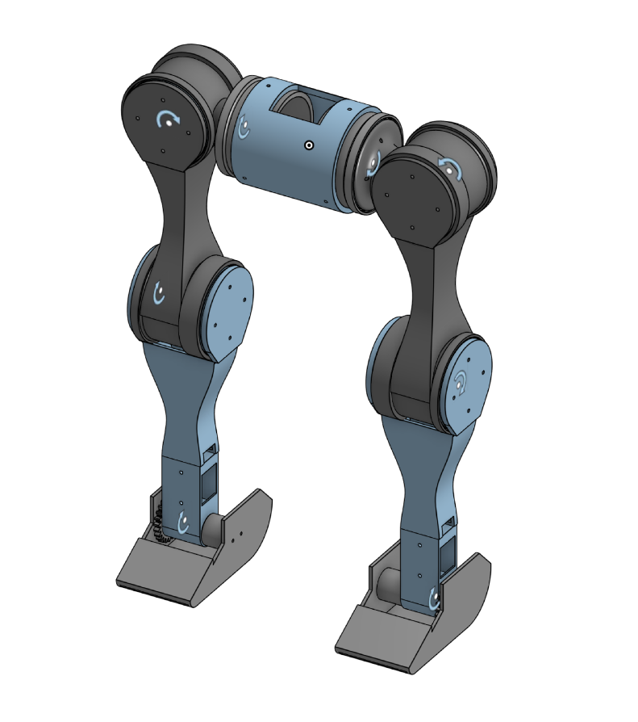

# Flexwalk

Flexwalk is an open-source humanoid bipedal which you can build and customize.

This project focuses on designing and fabricating a humanoid bipedal lower body (40-50 cm height)
We will develop a mechanically feasible lower-body humanoid structure capable of replicating human leg kinematics using Hip (Roll + Pitch), Knee (Pitch), and Ankle (Pitch) joints.

---

## Specifications

| **Specification** | **Value** |
| --- | --- |
| Height | ~50cm |
| Weight | 1.3kgs |
| Degrees of Freedom | 8 |
| Onboard Compute | Waveshare Serial Bus Servo Driver Board |
| Structural Materials | PLA |
| Motors | Sts3215|
---

## Getting Started

**Prerequisites**
- `- Mujoco 3.7`
- `- Python 3.10.12`

**Installation**
1. Clone the repository:
- `git clone https://github.com/Dhruva245/Flexwalk.git`
- `cd Flexwalk/`
2. Installing python dependencies:
- `pip install mujoco numpy`
3. Running the simulation:
- `python3 Scripts/ik_traj.py`
- `python3 Scripts/previewcontrol.py`

---

## Project Status
We have finished V2 simulation and are working on assembly
 Our next step will be to teleoperate Flexwalk v2

---

## Documentation

---

## Visuals
<table>
  <tr>
    <td rowspan="2">
      
    </td>
    <td>
      
    </td>
  </tr>
  <tr>
    <td>
      
    </td>
  </tr>
</table>

---
