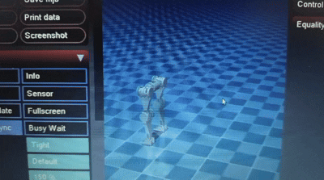
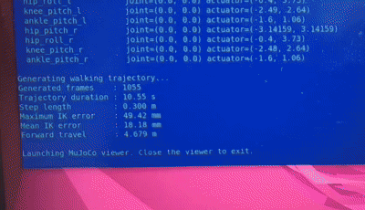

# Flexwalk

Flexwalk is an open-source humanoid bipedal which you can build and customize.

This project focuses on designing and fabricating a humanoid bipedal lower body (40-50 cm height).
 We will develop a mechanically feasible lower-body humanoid structure capable of replicating human leg kinematics using Hip (Roll + Pitch), Knee (Pitch), and Ankle (Pitch) joints.
<h3>Joint mechanism</h3>
 The spur-gear mechanism allows the FlexWalk joints to transmit servo torque efficiently, increase the effective joint torque, and provide a compact mechanical transmission between the servo and the robot links.
 With the 2:1 ankle transmission, the servo-side gear has half the number of teeth of the output gear. Ideally, this means the output gear rotates at approximately half the speed of the servo while receiving approximately twice the torque. The 1.5:1 hip and knee transmission reduces the output speed by a factor of 1.5 while increasing the available output torque by approximately 1.5 times.
 The ankle joint of FlexWalk incorporates a pivot mechanism that acts as the main rotational support for the lower leg and foot assembly. The pivot provides a defined axis about which the foot can rotate relative to the rest of the leg. This arrangement provides FlexWalk with a strong and stable ankle structure, while allowing the foot to rotate as required during different phases of walking, such as foot lifting during the swing phase and controlled contact with the ground during the stance phase.

---

## Specifications

| **Specification** | **Value** |
| --- | --- |
| Height | ~50cm |
| Weight | 1.3kgs |
| Degrees of Freedom | 8 |
| Onboard Compute | Waveshare Serial Bus Servo Driver Board |
| Structural Materials | PLA |
| Motors | Sts3215|
---

## Getting Started

**Prerequisites**
- `- Mujoco 3.7`
- `- Python 3.10.12`

**Installation**
1. Clone the repository:
- `git clone https://github.com/Dhruva245/Flexwalk.git`
- `cd Flexwalk/`
2. Installing python dependencies:
- `pip install mujoco numpy`
3. Running the simulation:
- `python3 Scripts/ik_traj.py`
- `python3 Scripts/previewcontrol.py`

---

## Project Status
We have finished V2 simulation and are working on assembly
 Our next step will be to teleoperate Flexwalk v2

---

## Documentation

---

## Visuals
<table>
  <tr>
    <td rowspan="2">
      
    </td>
    <td>
      
    </td>
  </tr>
  <tr>
    <td>
      
    </td>
  </tr>
</table>

---
